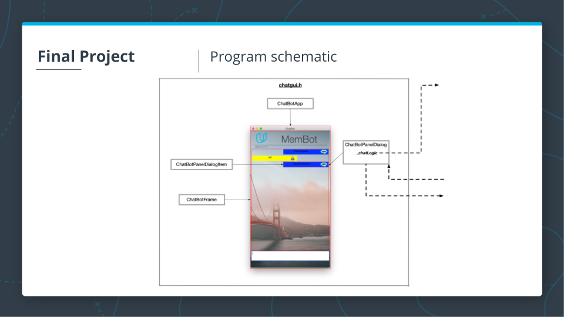

# CPPND: Memory Management Chatbot

This is the project for the third course in the [Udacity C++ Nanodegree Program](https://www.udacity.com/course/c-plus-plus-nanodegree--nd213): Memory Management.

## Project Concept
Learn [Resource management](http://isocpp.github.io/CppCoreGuidelines/CppCoreGuidelines#S-resource):
1. Learn about dynamic allocation, malloc/free, and new/delete
2. Why we need new/delete after OOP was introduced and how to overload them for various reasons.
3. What are the memory problems that happen with new/delete? Problems like a memory leak, dangling pointers, and so on.
4. How data is being copied between objects, and what problems happen (like shallow copying).
5. The rule of three describes the necessity of implementing the constructor, copy constructor and destructor, and destructor. Copying ways have a strong relationship to the philosophy behind smart pointers (no copying-> unique_ptr, exclusive, shared copying -> shared_ptr, and exclusive ownership also relates to the unique_ptr after their resources are moved, they are owned by only one object).
6. Then, we come to discover that copying causes a lot of unnecessary creation, allocation, and deletion when objects are returned by value. We need to solve this problem for more memory efficiency.
7. The ultimate solution of the copying is moving through move semantics. To understand move semantics, we need to know the concepts of lvalue and rvalue.
8. Then, we learn about the rule of five that describes the structure of classes that can move resources rather than copying them.
9. Then comes the RAII concept and how it is good to eliminate the need to delete or free resources by wrapping them around an object that takes care of that.
10. The next topic is smart pointers. Please notice that they apply both move semantics and RAII to their internal resources (raw pointers) and eliminate the need to free them.
11. Smart pointers types, use cases, and conversion between them.
12. The topic of ownership and ways to pass smart pointers to function and vice-versa

There are two important related concepts to memory management that were not discussed deeply in the course. They are copy ellision, or omission, and return value optiimization. [This](https://stackoverflow.com/questions/12953127/what-are-copy-elision-and-return-value-optimization) is a good discussion about them with references to more detailed resources. 
## Build and run
The instructions is written in the original starter code [repository](https://github.com/udacity/CppND-Memory-Management-Chatbot).

## Program Schematic
The `_chotLogic` handle communicate with GUI. `_chotLogic` owns `_nodes`. Each Node in `_nodes` owns its child Edges. And `_chatbot` is moving to each Node that pass the answer to the user.

## Reviewer recommended reference material
* [Google C++ Style Guide](https://google.github.io/styleguide/cppguide.html)
* [Understanding GCC warnings](https://developers.redhat.com/blog/2019/03/13/understanding-gcc-warnings#)
* Understanding Move Semantics and Perfect Forwarding: [part 1](https://medium.com/@dr3wc/understanding-move-semantics-and-perfect-forwarding-987cf4dc7e27), [part 2](https://medium.com/@dr3wc/understanding-move-semantics-and-perfect-forwarding-part-2-6b8266b6cfa4), [part 3](https://medium.com/@dr3wc/understanding-move-semantics-and-perfect-forwarding-part-3-65575d523ff8).
* [When C++ doesn't move](https://pspdfkit.com/blog/2019/when-cpp-doesnt-move/)
* [Understanding when not to std::move in C++](https://developers.redhat.com/blog/2019/04/12/understanding-when-not-to-stdmove-in-c/)